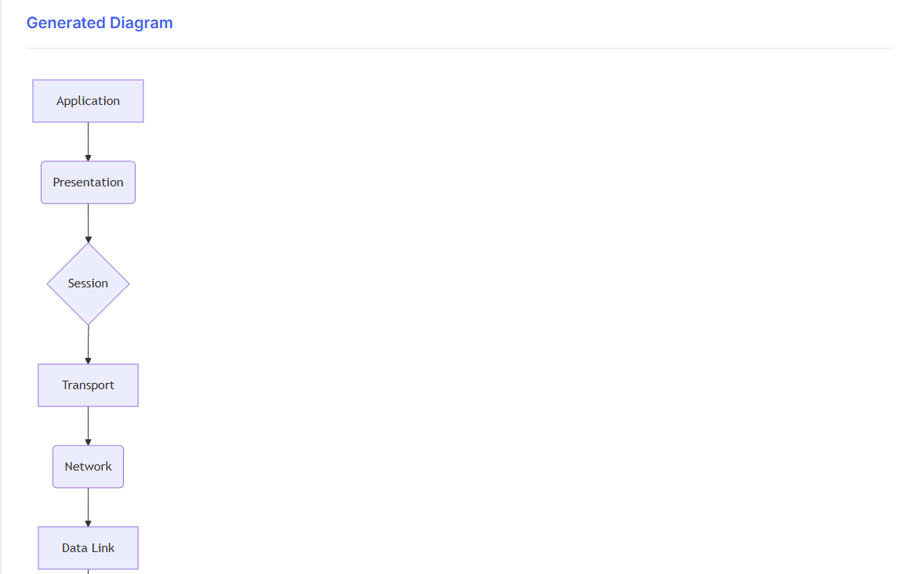

# Ideaflow AI Diagram Generator


A modern web application that leverages AI to automatically generate Mermaid diagrams from Notion pages. Simply input your Notion page title, and the application will extract content, analyze relationships, and create beautiful, structured diagrams.  

## Features

- **Notion Integration**: Extract content from Notion pages using the official Notion API
- **AI-Powered Diagramming**: Automatically generate Mermaid diagram code based on extracted content
- **Modern UI**: Clean, responsive interface with professional styling
- **Real-time Rendering**: Instantly preview generated diagrams

## Installation

### Prerequisites

- Python 3.8 or higher
- Node.js (for the server component)
- Notion API Key

### Setup

1. Clone the repository:
   ```bash
   git clone https://github.com/Dharansh-Neema/Ideaflow-AI-diagram-generation.git
   cd Ideaflow-AI-diagram-generation
   ```

2. Install Python dependencies:
   ```bash
   pip install -r requirements.txt
   ```

3. Set up your environment variables:
   - Create a `.env` file in the project root
   - Add your Notion API key: `NOTION_API_KEY=your_api_key_here`

4. Run the application:
   ```bash
   python main.py
   ```

5. Open your browser and navigate to `http://localhost:8000`

## Usage

1. Open the application in your web browser
2. Enter the title of your Notion page in the input field
3. Click the "Generate Diagram" button
4. View the automatically generated Mermaid diagram

## Example Output



### Key Components

- **Notion API Integration**: Extract structured content from Notion pages
  - `extract_notion_page_content`: Basic page extraction
  - `get_block_content_recursive`: Gets nested blocks recursively
  - `extract_notion_page_with_content`: Comprehensive extraction with all content
  - `extract_readable_content`: Converts API response to readable format

- **AI Analysis**: Process and understand the relationships between content elements

- **Diagram Generation**: Convert processed content into Mermaid syntax

- **Web Interface**: Display the diagram with a clean, professional UI

## Technologies

- **Backend**: Python, FastAPI
- **Frontend**: HTML, CSS, JavaScript
- **Diagramming**: Mermaid.js
- **API Integration**: Notion API

